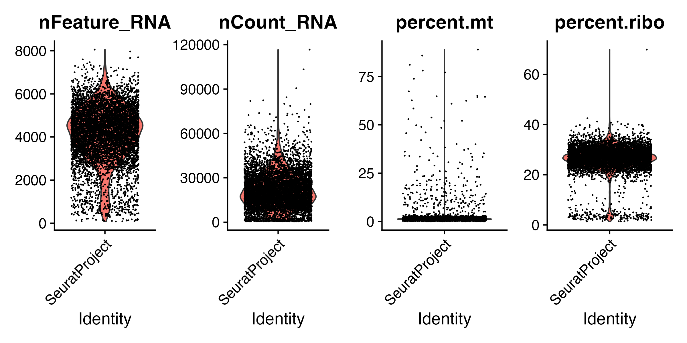
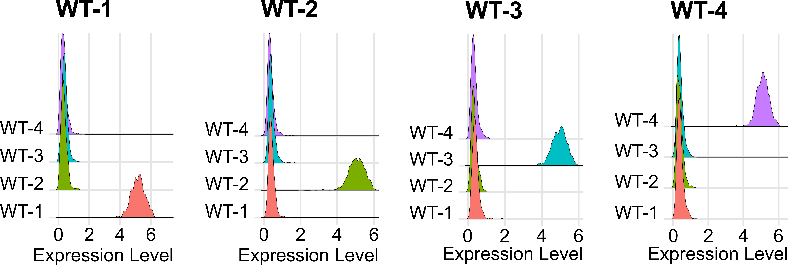
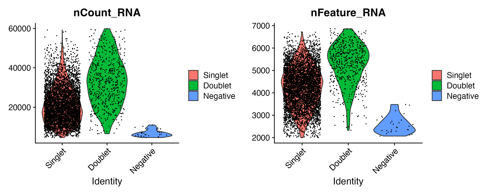

# Quality Control, Filtering and HTO Demultiplexing using Seurat in R

This repository contains an R Notebook (in .rmd format) that guides through quality control (QC) filtering and demultiplexing of high-throughput oligonucleotide (HTO) data using Seurat in R.

[Access the R Notebook "3_QCfiltering_HTOdemux" file here]((/R_notebooks/3_QCfiltering_HTOdemux.Rmd))

The accompanying R Notebook file (.rmd) details the step-by-step process to:

### Step 1: Load and preprocess single-cell RNA-seq data

The first step involves loading three distinct files:
- A file containing TCR reanalyzed gene expression and ADT information.
- A file comprising gene expression and HTO (hashtag) data.
- An Excel file containing paired TCR information.

After loading and preprocessing, a Seurat object is constructed, consolidating information as follows:
- Gene expression and ADT expression are extracted from the TCR reanalyzed gene expression and ADT file.
- Hashtag information is derived from the gene expression and HTO file.
- These datasets are merged into a unified Seurat object, amalgamating gene expression, ADT expression, and hashtag data.

The final Seurat object incorporates TCR information as metadata, providing a comprehensive representation of the processed single-cell RNA-seq data.

### Step 2: Perform quality control assessment and filtering
QC assessment includes examining the total number of transcripts (nCount_RNA), total number of unique genes (nFeature_RNA), mitochondrial (precent.mt) and ribosomal transcript percentages (percent.ribo) on a per cell basis to filter out poor-quality cells.
  
  

### Step 3: Demultiplex cells using HTO enrichment
Demultiplexing is performed based on HTO tags to distinguish and assign unique identifiers to cells.

  

### Step 4: Isolate singlets and assign identifiers
Identifying and isolating singlet cells. Assigning unique identifiers for downstream analysis and visualization.

  

This notebook serves as a comprehensive guide for processing and initial analysis of scRNA-seq data using Seurat in R.

*Note: The R Notebook contains code chunks, annotations, and visualizations for detailed implementation.*
