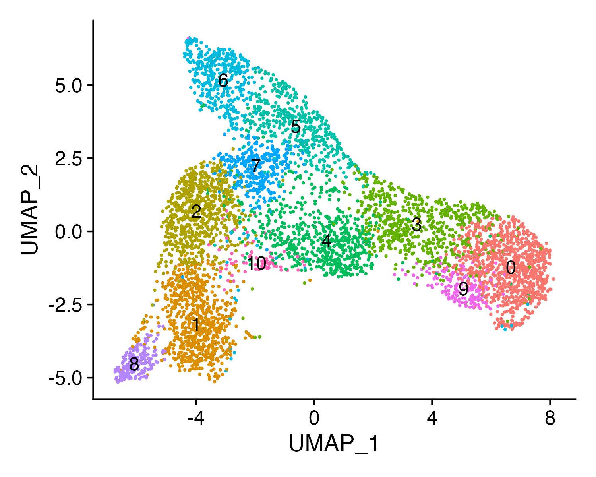
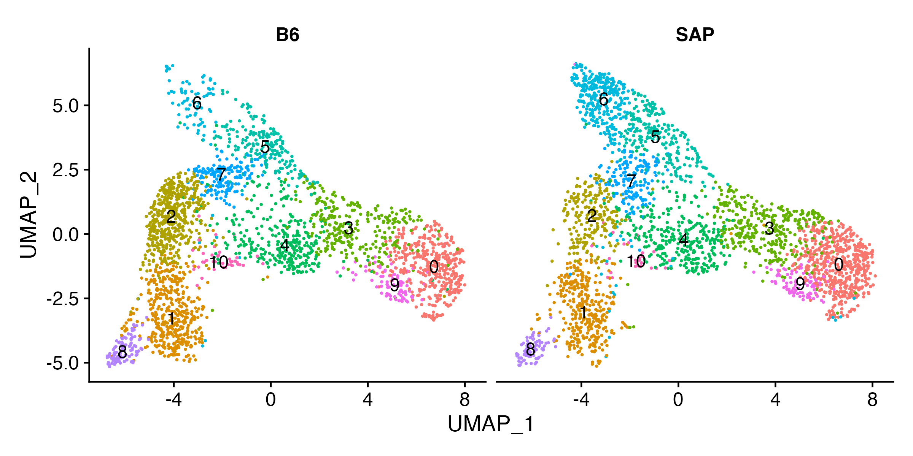
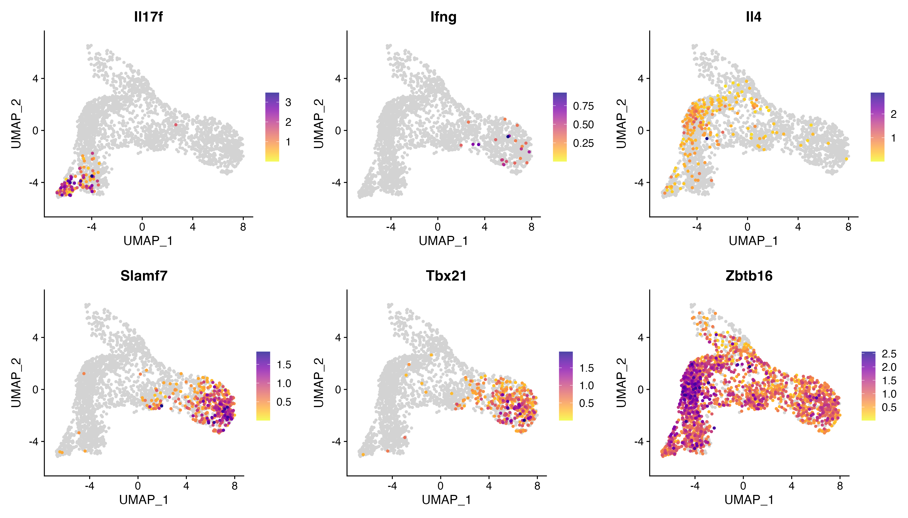
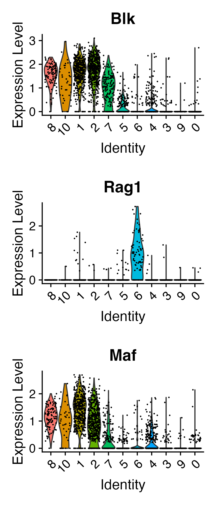
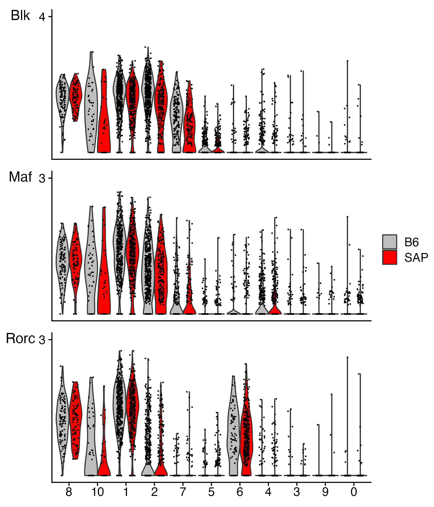
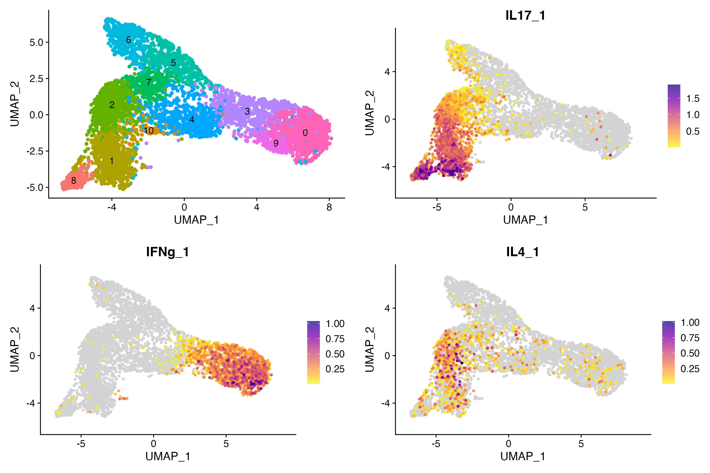
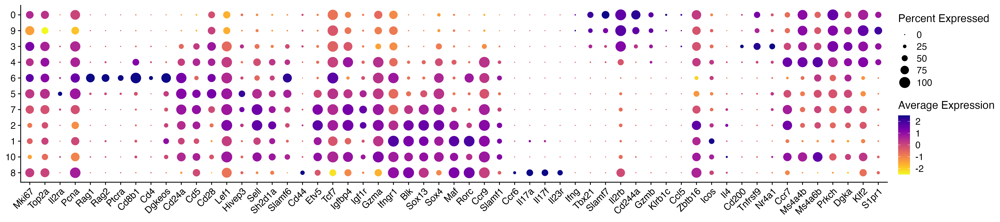

# Data normalization (integration), clustering and basic visualization in R

This repository contains an R Notebook (in .rmd format) that guides through Data normalization (integration), clustering and basic visualization in R.

[Access the R Notebook (4_Normalization_clustering_BasicViz.Rmd)](/R_notebooks/4_Normalization_clustering_BasicViz.Rmd)

### Step 1: Data Loading, Normalization (with/without data integration)
The first step involves loading the following file: "data_filtered_demux.singlet.rds". It is required that this .rds file is in the current folder with the .rmd file.

After loading filtered data, sctransform normalization is utilized to mitigate technical variability in single-cell RNA sequencing data, ensuring robust downstream analyses. At this step, undesirable features can be regressed out. This normalization method effectively accounts for differences in library sizes and capture efficiencies across cells, enabling fair comparisons between them. Whether to integrate datasets at this stage depends on the experimental setup: integration is recommended when merging multiple samples or batches to minimize batch effects, while for a single-sample analysis, integration might not be necessary. The decision to integrate should consider the presence of batch effects and the need to harmonize datasets for more accurate downstream clustering and visualization.

### Step 2: Clustering
Perform PCA, RunUMAP, FindNeighbors, and FindClusters on the normalized dataset. Play around with the number of dimensions and resolution to generate optimum semi-supervised clustering.
 
  

### Step 3: Data Visualization
- **1. Visualize B6 vs. SAP KO Cells:** Explore cluster differences between B6 and SAP KO cells.

 

- **2. Featureplots:** Use FeaturePlot to visualize gene expression patterns between B6 and SAP KO cells.

- **3. Violin Plots:** Generate violin plots showcasing gene expression levels.

 

- **4. Module Scoring:** Visualize module scores of specific gene sets across clusters.

- **5. Bubble plots:** Visualize bubble plots specific gene sets across clusters.

For detailed code chunks and explanations, refer to the original R Notebook file.
