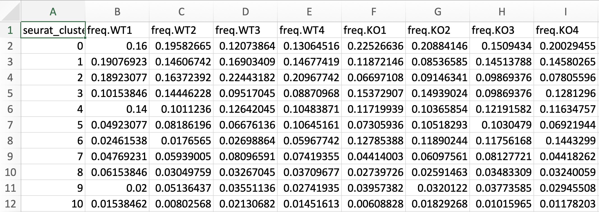
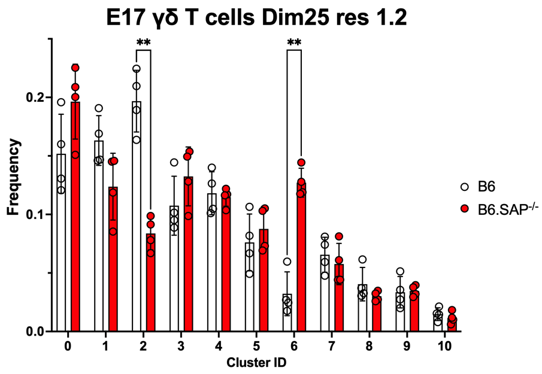

# Cell Frequency Calculation per cluster, Visualization and Analysis

This repository contains an R Notebook (in .rmd format) guiding through clustering frequency calculation in R.

[Access the R Notebook (5_cluster_freq_calculation.Rmd)](/R_notebooks/5_cluster_freq_calculation.Rmd)

### Step 1: Data Loading and Variable Definition
The initial step involves loading the clustered Seurat object file named "data_clust_cc_stress_regressed.rds" into the notebook. Ensure this file is in the same folder as the .rmd file.

Variables are defined in this section to generate the final filename automatically, serving to maintain a record of the specific datasets used in the analysis.

### Step 2: Cluster Frequency Calculation
This section deals specifically with analyzing B6 and SAP KO samples to generate a CSV file. Adjust the script if the number of samples per group changes. The primary objective is to calculate the frequency of cells in each cluster for both B6 and SAP KO samples.

 

[Download a sample CSV Output File](/miscellaneous/5_sample_cell_freq_calculation_csv_output.csv)

### Step 3: Data Visualization and Analysis in GraphPad Prism
The generated CSV file can be easily imported into GraphPad Prism. Utilize this data in Prism to create bar plots illustrating cell cluster frequencies and conduct statistical analyses such as t-tests, ANOVA, or other relevant tests to evaluate differences between B6 and SAP KO samples.

[Download a sample PRISM File for visualization and analysis](/miscellaneous/5_sample_cell_freq_calculation_prism.pzfx.csv)

------End------