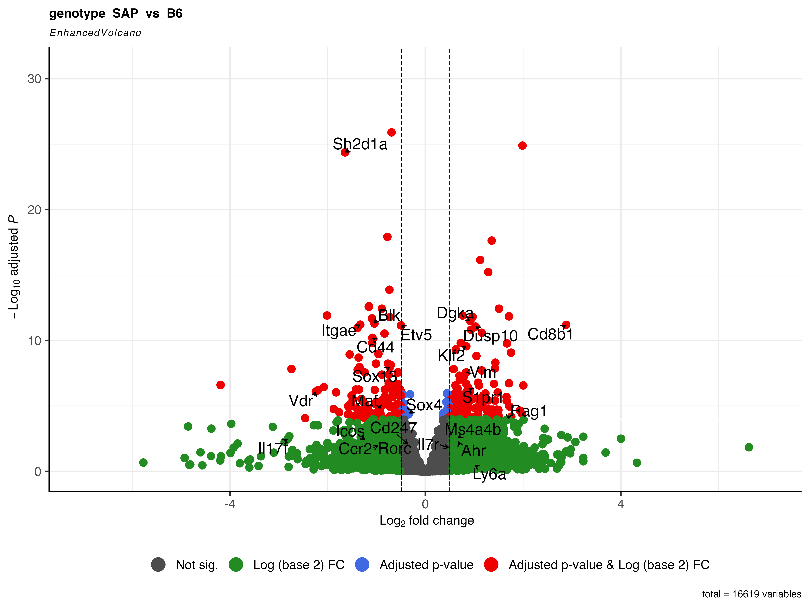

# Pseudobulk Differential Gene Expression Analysis using DESeq2
This repository provides an R Notebook guiding through the analysis of pseudobulk differential gene expression using the DESeq2 package in R.
Pseudobulk analysis serves as a valuable approach in single-cell RNA sequencing (scRNA-seq) data analysis by aggregating transcriptomic information from individual cells into group-level profiles. This method helps mitigate the noise inherent in scRNA-seq datasets due to the presence of technical variability, low expression levels, and high sparsity. By aggregating cells into pseudobulk profiles based on sample groups or conditions, pseudobulk analysis enables the identification of robust and statistically significant differential gene expression patterns between distinct cellular populations. It provides an opportunity to perform bulk-like analysis while retaining the resolution gained from single-cell experiments, facilitating the identification of biological insights and molecular changes across different conditions or experimental groups.
[Access the R Notebook (6_pseudobulk_DGE_analysis.Rmd)](/R_notebooks/6_pseudobulk_DGE_analysis.Rmd)

### Step 1: Data Loading and Metadata Modification

Begin by reading the clustered scRNA-seq data utilizing the provided code snippet. Following this, the Seurat object (‘data’) undergoes modification in sample identifiers. Reassigning sample identifiers within the Seurat object aids in differentiating various sample groups or conditions, crucial for downstream analyses.

### Step 2: Subsetting Specific Clusters (if Needed)

This stage involves a precise selection of clusters within the Seurat object (‘data’) to focus on specific subsets for subsequent analyses or visualization. Utilize the provided code to select clusters of interest within the Seurat object, enabling a more targeted exploration of particular cellular populations.

### Step 3: Preparing Data and Running DESeq2

Aggregate counts to the sample level and extract sample-level metadata from the processed data. Initialize a DESeq object (‘dds’) for further differential expression analysis. The dataset is filtered to retain genes meeting specific count criteria. Subsequently, execute DESeq analysis, which identifies differential expression patterns between sample groups, and summarize significant results based on statistical measures.

### Step 4: Data Visualization

- **1. Plot PCA:** Utilize the variance stabilizing transformation (vst) of the DESeq object to generate a PCA plot. This plot provides a visual representation of the dataset’s variability and the separation of samples based on gene expression patterns.

 

- **2. CSV Output:** Extract DESeq2 results, format them as a CSV file, and save them for further analysis. Additionally, generate normalized counts from the dataset and save them separately in another CSV file. These outputs facilitate downstream analyses or data sharing.

 

- **3. Enhanced Volcano Plot:** Employ the EnhancedVolcano package to create a visually informative volcano plot. This plot showcases log2 fold change against adjusted p-values, aiding in the identification and visualization of differentially expressed genes. Save this plot in both SVG and PNG formats for better accessibility and usage.

 

For detailed code chunks and explanations, refer to the original R Notebook file.
