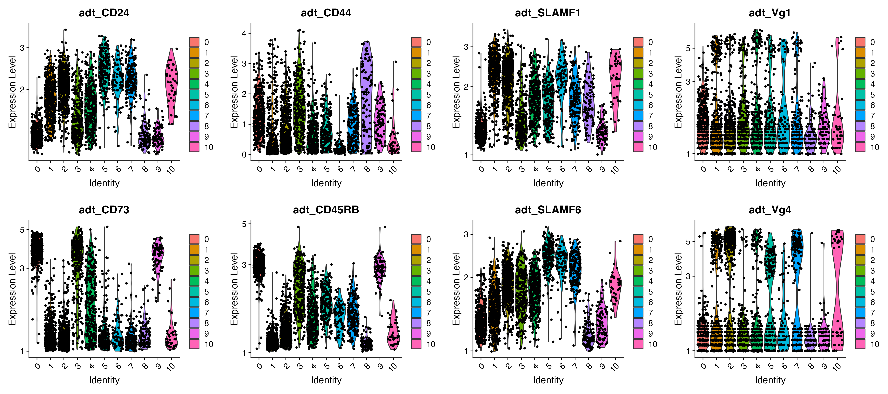
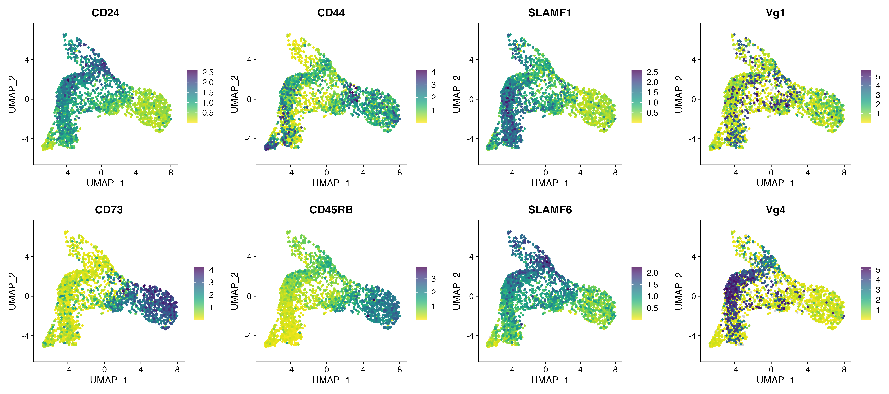

# Cell Surface Protein (ADT) Visualization using R

This repository provides an R Notebook guiding through the analysis of ADT (Antibody Derived Tags) protein visualization using R.

ADT protein visualization serves as a crucial step in understanding single-cell RNA sequencing (scRNA-seq) data. By examining protein expression patterns, this analysis aids in deciphering cellular characteristics and identifying distinctive markers.

[Access the R Notebook (7_ADT_protein_visualization.Rmd)](/R_notebooks/7_ADT_protein_visualization.Rmd)

### Step 1: Data Loading

Begin by reading the clustered scRNA-seq data which can be found in the "4_Normalization_clustering_BasicViz" folder.

### Step 2: Normalization and Optional Data Subsetting

Normalize the ADT data and optionally subset the dataset to focus on specific cell types or conditions. This allows for a more targeted exploration of particular cellular populations.

### Step 3: Visualization

#### 1. Violin Plot

Create violin plots to visualize ADT expression levels across clusters. The plots display the distribution of protein expression for specific ADT markers across different cellular populations.

 

#### 2. Feature Plot

Generate feature plots to analyze the expression patterns of specific markers within the 'ADT' data subset. These plots utilize the 'viridis_dark_high' color palette and provide insights into marker expression profiles.

 

For detailed code chunks and explanations, refer to the original R Notebook file.