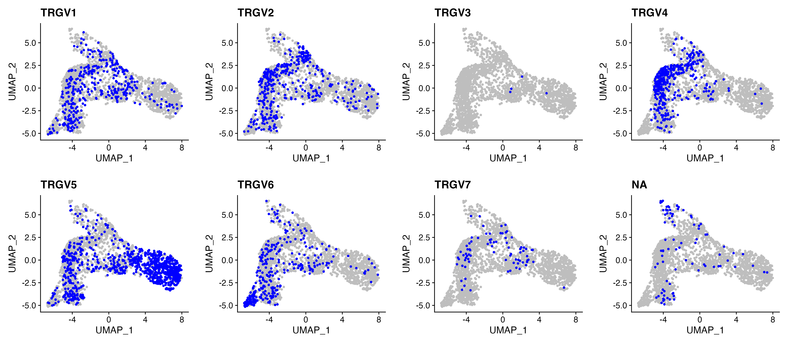
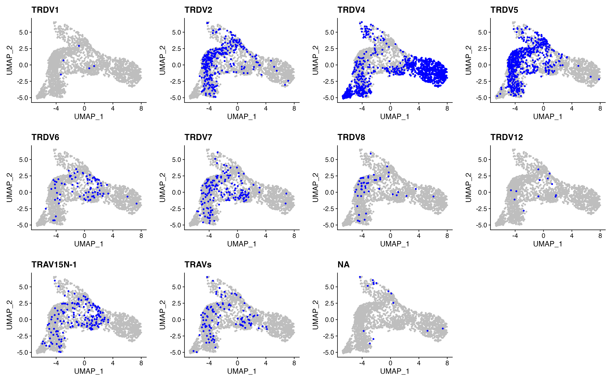
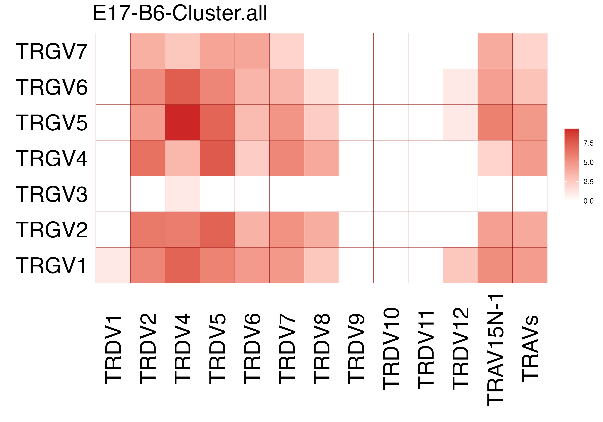
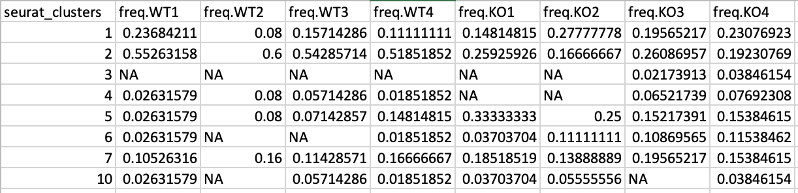
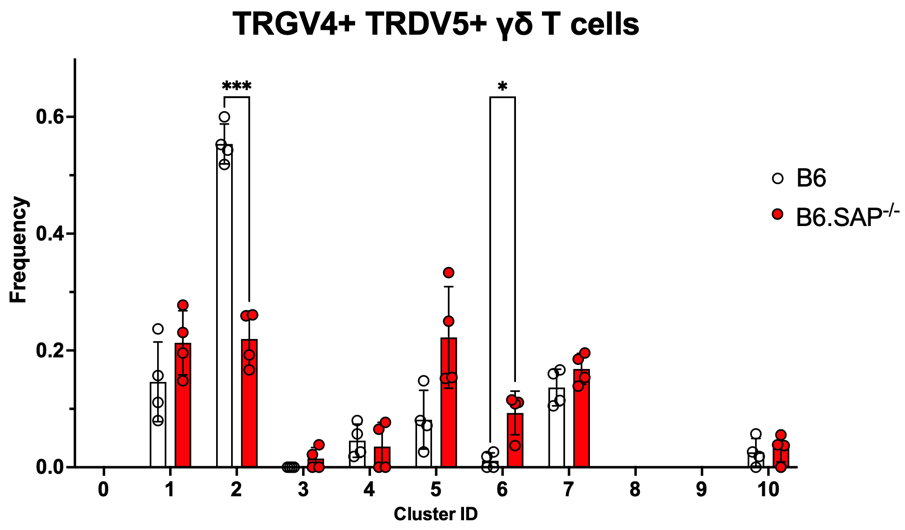

# TRGV and TRDV usage

This repository provides an R Notebook guiding through the analysis of TRGV and TRGV usage using R.

There are two R notebooks: 
1. 8.1_TRGV_TRDV_usage.Rmd
2. 8.2_TRGV_TRDV_usage_freq_calculation.Rmd

## R Notebook: 8.1_TRGV_TRDV_usage: 
Click [here](/R_notebooks/8.1_TRGV_TRDV_usage.Rmd) to access the R notebook. This R script comprises four major steps analyzing T-cell receptor variable gene (TRGV and TRDV) usage patterns in single-cell RNA-seq data:

### Step 1: Data Loading and Variable Definition: 
Retrieve the necessary input file and load essential packages. Define variables and load clustered data, setting up subsets for subsequent analysis.

### Step 2:TRGV (γ chain) usage visualization:
Focus on visualizing TRGV gene usage patterns across various cell types and clusters. Generate UMAP plots for individual TRGV genes to depict their expression profiles.
	

 
	
### Step 3: TRDV (δ chain) usage visualization: 
Dedicated exploration similar to Step 2 but for TRDV genes. Visualize TRDV gene expression patterns across different cell types and clusters using UMAP plots.
	

 
	
### Step 4: Paired TRGV and TRDV Usage Heatmap Creation:
Perform comprehensive data processing steps. Remove ‘NA’ entries, group unique gene pairs, calculate counts, add log2 transformed values, fill missing combinations, and summarize duplicates. Generate a heatmap showcasing the relationship between paired TRGV and TRDV gene usage based on log2-transformed counts. Save the resulting heatmap as a PNG image for further exploration and analysis.
	

## R Notebook: 8.2_TRGV_TRDV_usage_freq_calculation:

Click [here](/R_notebooks/8.2_TRGV_TRDV_usage_freq_calculation.Rmd) to access the R notebook. This R script comprises four major steps analyzing T-cell receptor variable gene (TRGV and TRDV) usage patterns in single-cell RNA-seq data:

### Step 1: Data Loading and Variable Definition
The initial step involves loading the clustered Seurat object file named "data_clust_cc_stress_regressed.rds" into the notebook. Ensure this file is in the same folder as the .rmd file.

Variables are defined in this section to specify specific pairings such as TRGV4/TRDV5 or TRGV6/TRDV4. The cluster frequencies are calculated after subsetting the cells using the specific TRGV/TRDV pairings.

### Step 2: Cluster Frequency Calculation
This section deals specifically with analyzing B6 and SAP KO samples to generate a CSV file. Adjust the script if the number of samples per group changes. The primary objective is to calculate the frequency of cells in each cluster for specific TRGV/TRDV paired B6 and SAP KO cells.

 

[Download a sample CSV Output File](/miscellaneous/8_TRGV_TRDV_cell_freq_calculation_csv_output.csv)

### Step 3: Data Visualization and Analysis in GraphPad Prism
The generated CSV file can be easily imported into GraphPad Prism. Utilize this data in Prism to create bar plots illustrating cell cluster frequencies and conduct statistical analyses such as t-tests, ANOVA, or other relevant tests to evaluate differences between B6 and SAP KO samples.

[Download a sample PRISM File for visualization and analysis](/miscellaneous/8_TRGV_TRDV_cell_freq_calculation_prism.pzfx)