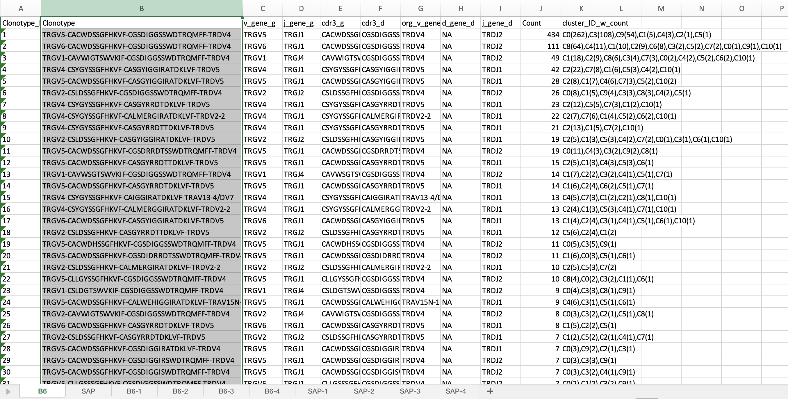
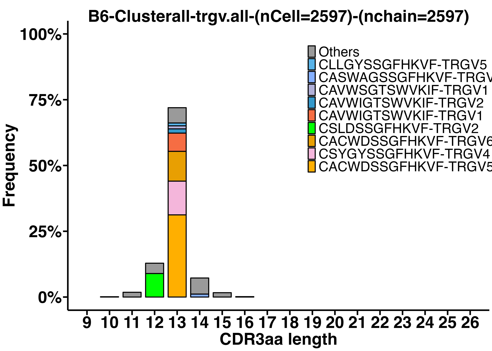
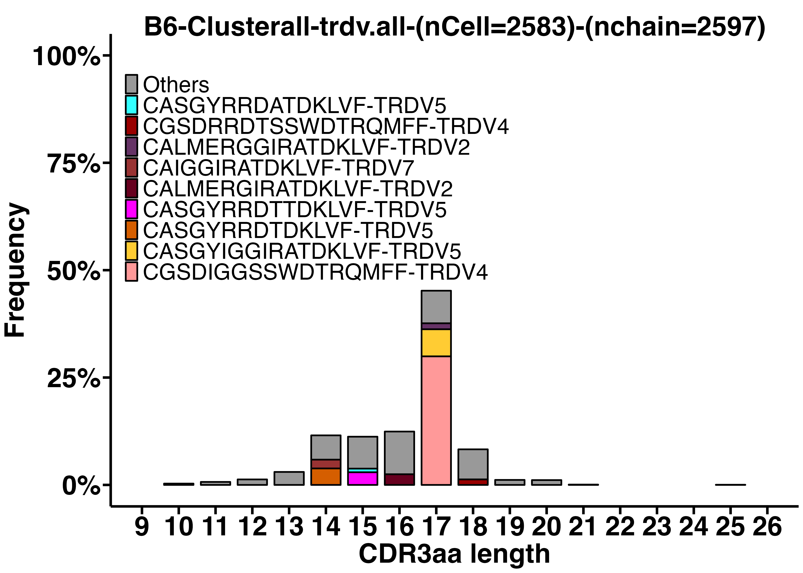
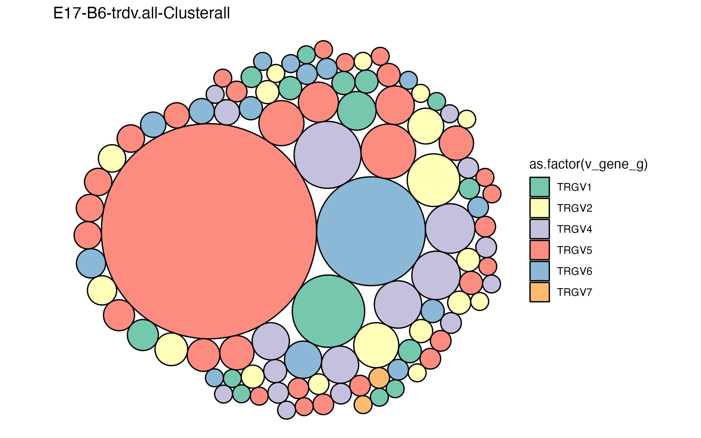
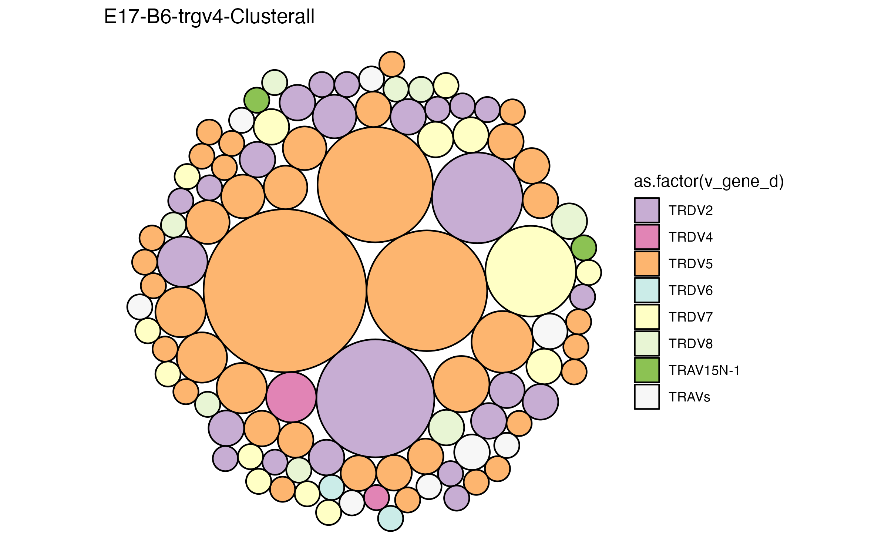

# TCR CDR3 clonotype analysis

This repository provides an R Notebook guiding through the analysis of paired or unpaired CDR3γ and CDR3δ analysis using R.

There are five R notebooks with distinct final output: 
1. 9.1_clonotype_abundance_list.Rmd
2. 9.2_CDR3γ_or_CDR3δ_amino_aa_length_distribution.Rmd
3. 9.3_clonotype_top100_bubbleplot.Rmd
4. 9.4_clonotype_abundance_dotplot.Rmd
5. 9.5_clonotype_diversity_scRepertoire.Rmd

## R Notebook: 9.1_clonotype_abundance_list: 
Click [here](/R_notebooks/9.1_clonotype_abundance_list.Rmd) to access the R notebook. The the output of this R script is one excel file that lists all the clonotypes (paired CDR3γ and CDR3δ) from WT and KO samples as well as individual biological replicates. The clonotypes are arranged in decreasing counts. The output looks like the following with each sample as a separate tab/sheet in the excel file:

## R Notebook: 9.2_CDR3γ_or_CDR3δ_amino_aa_length_distribution:
Click [here](/R_notebooks/9.2_CDR3γ_or_CDR3δ_amino_aa_length_distribution.Rmd) to access the R notebook. The the output of this R script is two spectratype plots - one for TRGV CDR3γ amino acid (aa) length distribution and one for TRDV CDR3δ amino acid (aa) length distribution. By altering the variables, you can choose a specific sample, specific cluster(s) and specific TRGV/TRDV chains. The color coding of individual CDR3 sequences are little troublesome. I manually set the color order in the ggplot sections of the script. I do that to make sure the same clonotype in two or more plots have the same color. In future, a better automated system to color code the known clonotypes would be ideal.

 

## R Notebook: 9.3_clonotype_top100_bubbleplot.Rmd:

Click [here](/R_notebooks/9.3_clonotype_top100_bubbleplot.Rmd) to access the R notebook. The the output of this R script is two clonotype bubble plots - one for top 10 TRGV specific clonotypes (CDR3γ and CDR3δ) with color coding for TRDV and another one is for top 10 TRDV specific clonotypes (CDR3γ and CDR3δ) with color coding for TRGV. This script also outputs excel files showing the order of specific clonotypes shown on the plot.

 

## R Notebook: 9.4_clonotype_abundance_dotplot:

Work in progress

## R Notebook: 9.5_clonotype_diversity_scRepertoire:

Work in progress